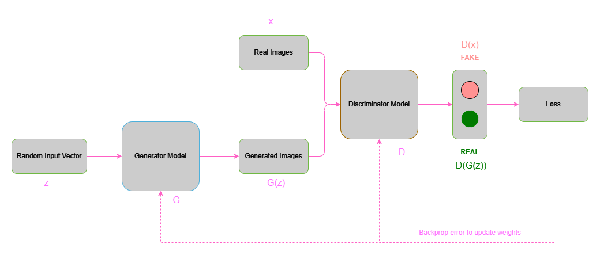

# Generative Adversarial Network (MNIST)

## Introduction

Generative Adversarial Networks (GANs) are a class of deep learning models used for generative tasks, such as image generation. GANs consist of two neural networks, the generator and the discriminator, which are trained together in a game-theoretic framework. The key idea is that these two networks are adversaries, with one trying to generate realistic data (the generator), and the other trying to distinguish between real and generated data (the discriminator).

## Generator

The generator takes a random noise vector, usually denoted as $z$, sampled from a simple distribution (e.g., Gaussian distribution), as input. It transforms this noise vector into a data point, typically an image, denoted as $G(z)$. The goal of the generator is to produce data that is indistinguishable from the real data.

Mathematically, the generator function $G$ is a neural network parameterized by weights and biases $\theta$. It learns to approximate the true data distribution $p_{data}(x)$ with a generated distribution $p_{gen}(x)$. This can be represented as $G(z; \theta) \approx p_{data}(x)$.

## Discriminator

The discriminator takes an input data point (either real or generated), denoted as $x$, an outputs a probability score, $D(x)$, which represents the likelihood that $x$ is a real data point.

Mathematically, the discriminator function $D$ is another neural network with weights and biases $\phi$. It learns to distinguish between real data and generated data. The discriminator's goal is to maximize the probability of assigining high scores to real data and low scores to generated data.

## Objective Function

GANs are trained using a minimax game between the generator and the discriminator. The objecttive function can be expressed as:

$$\large \min_G \max_D V(D, G) = \mathbb{E}_ {x \sim p_{data}(x)}[logD(x)] + \mathbb{E}_{p_z(z)}[log(1 - D(G(z)))]$$

The first term $\mathbb{E}_ {x \sim p_{data}(x)}[logD(x)]$ encourages the discriminator to correctly classify real data as real, and the second term $\mathbb{E}_{p_z(z)}[log(1 - D(G(z)))]$ encourages the generator to produce data that the discriminator classifies as real.

## Training

The discriminator aims to maximize $V(D, G)$ by assigning high scores to real data and low scores to generated data. The generator aims to minimize $V(D, G)$ by producing data that the discriminator is more likely to classify as real. Training continues iteratively until an equilibrium is reached, ideally when the generator produces data that is indistinguishable from real data.

The optimal outcome of GAN training is a Nash Equilibrium, where the generator produces data that is identical to the real data distribution, and the discriminator is forced to assign a probability of 0.5 to both real and generated data.

## Implementation
This project is focused on developing a Generative Adversarial Network (GAN) from scratch using Pytorch to generate MNIST like digits. Data is downloaded and preprocessed by applying certain transformations. The generator and discriminator architectures are created using linear layers with batch normalization. Binary Cross Entropy loss along with Adam optimizer is employed for optimization of network parameters. These networks are then trained using GPUs in batches of 64 images. Losses collected during training are plotted to visualize adversarial learning and correlations. Finally, the trained generator is used to generate new images.

## Results

## Generated Samples

## References

1. Goodfellow, I.J., Pouget-Abadie, J., Mirza, M., Xu, B., Warde-Farley, D., Ozair, S., Courville, A., & Bengio, Y. (2014). *Generative Adversarial Networks.* 	arXiv:1406.2661 [stat.ML] DOI: https://doi.org/10.48550/arXiv.1406.2661
